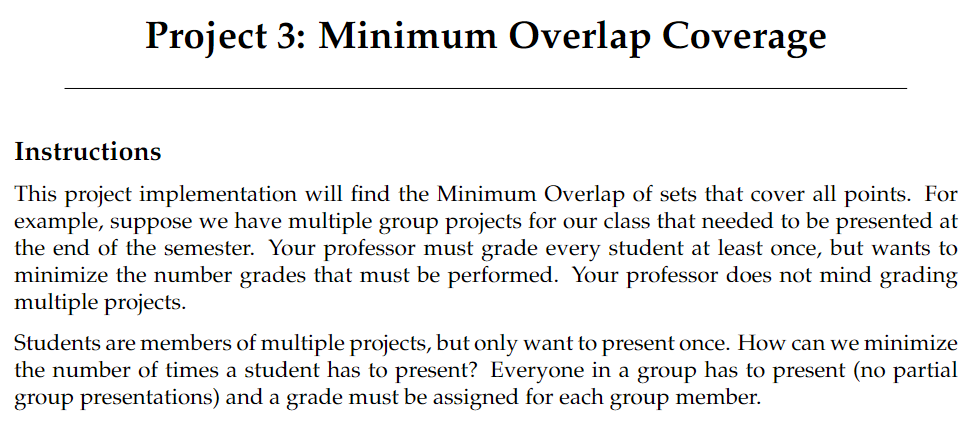

Portfolio
=========

Programming Projects
--------------------

*For access to my private project repositories, please [email me](mailto:rwosborne@csustudent.net?subject=GitHub%20Access) with the subject line, GitHub Access.

---
### [Pedigree Recreation Software Project | CSCI 495](project1)

---
### [Minimum Overlap Coverage | CSCI 315](project2)

---
### [Project 3 Title | CSCI 325](project3)

---
### [Project 4 Title | CSCI 332](project4)

---

Ethics Papers
-------------

### [How to Deal with Ad Blockers](/pdf/CSCI235_RWOsborne_EthicsPaper.pdf)

-   **Class: CSCI 235 Procedural Programming**  
-   **Grade: ??A??**

### [Intellectual Property](/pdf/CSCI301_RWOsborne_EthicsPaper.pdf)

-   **Class: CSCI 301 Survey Of Scripting Languages** 
-   **Grade: ??A??**

### [THERAC-25](/pdf/CSCI315_RWOsborne_EthicsPaper.pdf)

-   **Class: CSCI 315 Data Structure Analysis** 
-   **Grade: ??A??**

### [Data Breaches](/pdf/CSCI325_RWOsborne_EthicsPaper.pdf)

-   **Class: CSCI 325 Object Oriented Programming** 
-   **Grade: ??A??**

### [Memes](/pdf/CSCI330_RWOsborne_EthicsPaper.pdf)

-   **Class: CSCI 330 Computer Architecture** 
-   **Grade: ??A??**

---

Presentations
-------------

### [Data Breach Presentation](/pdf/CSCI301_Data_Breach_Presentation_RWOsborne.pdf)

- **Class: CSCI 301 Survey of Scripting Languages** 
- **Grade: A**

### [Account Manager Project](https://youtu.be/AyVZVRDA7cY)

- **Class: CSCI 325 Object Oriented Programming** 
- **Grade: A**

### [Team Project Software Training Video Presentation](https://youtu.be/g3Dkl3ZD6rs)

- **Class: CSCI 495 System Analysis and Software Design** 
- **Grade: B**

---

Page template forked from <a href="https://github.com/csu-cs/csci-portfolio">CSU-CS</a>

<!-- Remove above link if you don't want to attributive -->
