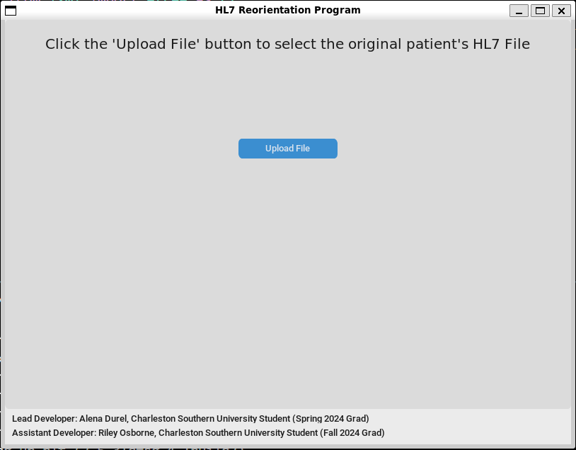
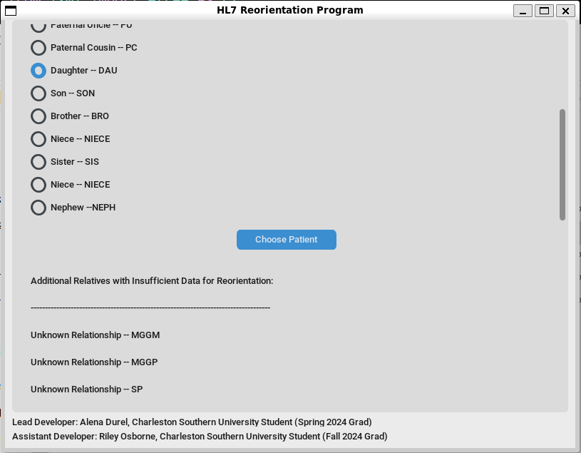
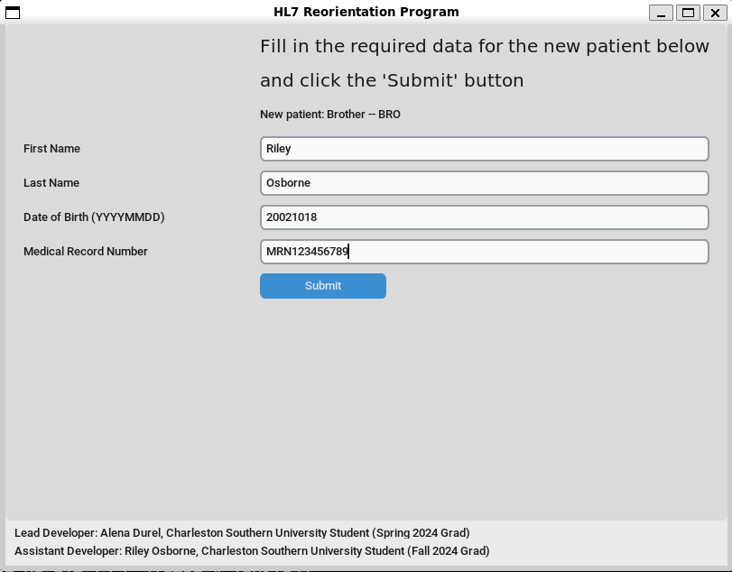
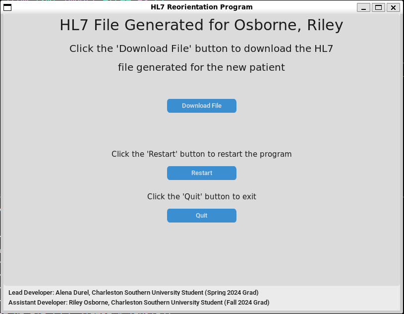

[Back to Portfolio](./)

Pedigree Recreation Software Project
===============

-   **Class: CSCI 495 System Analysis and Software Design** 
-   **Grade: B** 
-   **Language(s): Python** 
-   **Source Code Repository:** [click here](https://github.com/RileyOsborne26/Pedigree_Recreation)  
    (Please [email me](mailto:rwosborne@csustudent.net?subject=GitHub%20Access) with questions.)

## Project description

This project was in collaboration with MUSC and their work with cancer genetic patient testing. The patients going into the clinic for genetic tests are given a pedigree with their results that includes their family tree. The pedigree is an xml or hl7 file. The issue this program addresses is the need to rearrange pedigrees for patient's other family members coming in for the genetic tests. The pedigree is arranged in terms of the patient, so the clinic needed a pedigree recreation program that can take the old patient's pedigree and rearrange it in terms of the new patient, who is related to the old patient. The program is coded with XML format familiarity and can rearrange a pedigree for basically any family dynamic between the old and new patient (ex. Mother to daughter, son to Grandma).

## How to compile and run the program

How to compile (if applicable) and run the project.
Make sure your requirements listed in  are met and the repository is cloned into a project workfolder.

```bash
cd /home/<username>/<project folder>/
/usr/bin/python /home/<username>/<project folder>/Pedigree_Recreation/main.py
```
replace "<username>" with your user directory and "<project folder>" with the work directory name you chose.

For best demonstration results, choose the "/XMLFilesForTest/og 999b120 HL7 2023-11-16-1609.xml" file, which has the most pedigree recreation options.

## UI Design

The program offers four main UI interaction screens that define the entirety of its functions: The file selection screen (see Fig 1), the new patient selection screen (see Fig 2), the new patient information form (see Fig 3), and the download end screen (see Fig 4). 

The file selection screen contains instructions and an upload file button to help you choose an old patient's pedigree XML file (see Fig 1). When selection your new patient, the program has already parsed the file and lists all relatives from the pedigree. The program is also configured to separate the relatives into two groups, the selectable and non selectable relatives, who do not have enough info to be used for recreation (see Fig 2). The form (see Fig 3) is used to enter the new patient's first and last name, birthdate, and medical record number. As shown in figure four, you can download the reorganized pedigree, restart, or quit.

  
Fig 1. The file selection screen

  
Fig 2. Selecting the new patient

  
Fig 3. New patient info form

  
Fig 3. Download your results!

## 3. Additional Considerations

My main role for this project was assistant developer. Alena Durel was the lead developer and deserves the majority of credit for the project. This project was emotionally a shock to me when first presented, since my mom was tested for and diagnosed with breast cancer at the start of this project. She had the genetics test done which this software is being used with and if my little stister or any of my grandparents even go to get this test done, then this progam will be used to reorient my mom's pedigree for my sister or on of my grandparents as the new patient! I think that is mindblowing and in the midst of such a trying time I am grateful to have made a positive impact on the topic of cancer. As of now we can also celebrate that my mom is cancer free after 7-8 months and her surgery!

[Back to Portfolio](./)