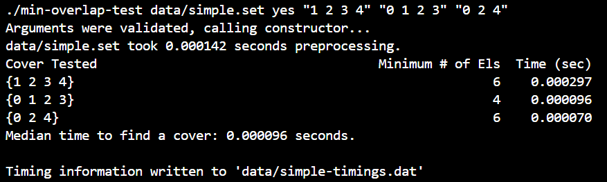
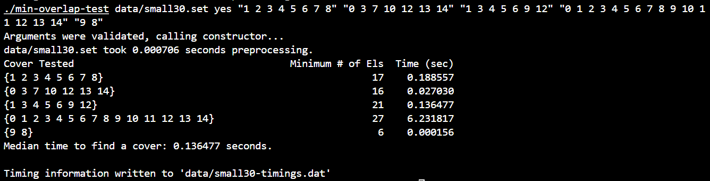
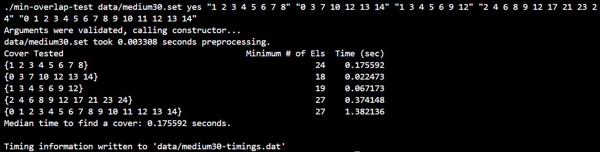
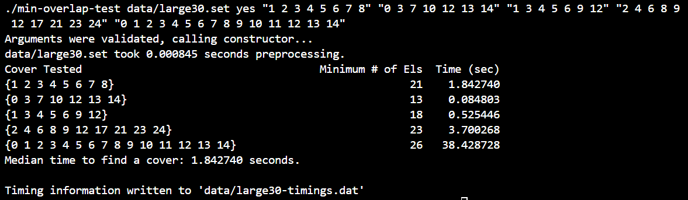

[Back to Portfolio](./)

Data Structures Project 3: Minimum Overlap Coverage
===============

-   **Class: CSCI 315 Data Structures** 
-   **Grade: 110% (A+) for the project** 
-   **Language(s): C++** 
-   **Source Code Repository:** [click here](https://github.com/RileyOsborne26/CSCI315_project3)  
    (Please [email me](mailto:rwosborne@csustudent.net?subject=GitHub%20Access) to request access.)

## Project description

This project uses an algorithm and datastructure which are set up to find the least number of elements to cover a given subset which I feed the program. The /data folder contains multiple dataset files, each file containing multiple subsets to test my subset parameter for the progam. So if I run 
```bash
make run simple
```
then one of the subsets that will be tested is "0 3 6".

These are the subsets listed in the "/data/simple.set" dataset:
```bash
0 2 5
0 2 3
1
2 3 6
1 4 3
5 6
```
In order to find the minimum overlap required to cover all the elements inside subset "0 3 6". Using ONLY the subsets listed in the simple.set data file, the program will combine them until it has found and created the smallest possible subset that meets our conditions of including elements "0 3 6". Looking at our subset above, the program would be able to recognize that all the following subsets combinations are examples of valid solutions:
```bash
0 2 5 0 2 3 2 3 6
0 2 3 2 3 6
0 2 5 2 3 6
0 2 5 1 4 3 2 3 6
0 2 5 1 4 3 5 6
0 2 5 5 6
0 2 3 5 6
etc...
```
The program will compute and recognize that the valid subset with the least amount of elements is 5 and will output that number under the "Minimum # of Els" column.

The intent of the project is to use the most efficient combination of datastructures and logic possible. This means getting as small of a time as possible to find the smallest subset match and to be able to do so for incredibly complex examples.

## How to compile and run the program

How to compile (if applicable) and run the project.
Make sure to clone the repository and navigate to your chosen workfolder. 
Inside your workfolder run "cd project3". The Pdf talks about the project and 
the makefile showns you the program running options.

Makefile run options:
```bash
make run small30
make run med30
make run large30
make run large50
make run small100
make run small-timings
make run medium-timings
make run large30-timings
make run large-timings
```

## UI Design

It is run straight from the command line. The figures below are sample results for all four of the sample types: simple dataset (see Fig 1), small dataset (see Fig 2), medium dataset (see Fig 3), and large dataset (see Fig 4).

  
Fig 1. Example output for the simple dataset

  
Fig 2. Example output for the small30 dataset

  
Fig 3. Example output for the medium30 dataset

  
Fig 4. Example output for the large 30 dataset

## 3. Additional Considerations

It is important to note that the small, medium, and large datasets are much more complex for the computer to handle, and in order to be efficient, the Big-O much be small enough to handle big testing subsets and/or dataset files with more subsets listed. This is what the number in the setfiles means. "small30.set" contains 30 small subsets while "small100.set" contains 100 small subsets. The size (small, medium, large) indicates how big the subsets are. If the program can not find a match for the testing subset then it will return "DNE" (does not exist). 

When I did this project, the instructions pdf gave examples for what times would be considered good enough for certain grades. I used a vector of vectors and initially, no matter what I tried to improve speed I could only get my top speed to 30 TIMES slower than needed for the 60% credit solution time given by Dr. Hayes. It turns out that the issue was my computer and when Dr. Hayes ran it, it was much faster and my solution ended up being worth 110%. 

[Back to Portfolio](./)