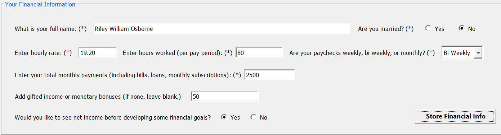
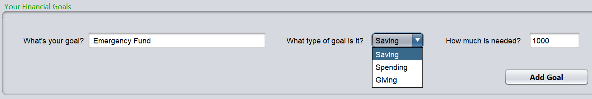
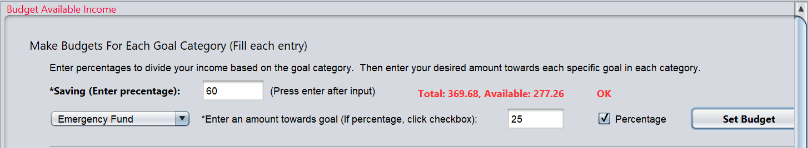
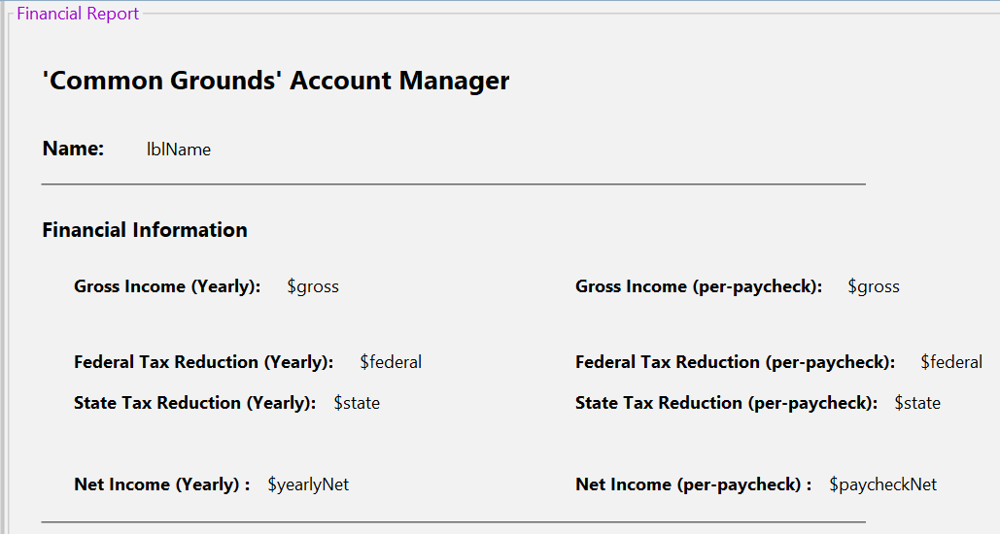

[Back to Portfolio](./)

Account Manager Team Project
===============

-   **Class: CSCI 325 Object-Oriented Programming** 
-   **Grade: 100 (A)** 
-   **Language(s): Java** 
-   **Source Code Repository:** [click here](https://github.com/RileyOsborne26/CSCI-325_Account_Mgmt)  
    (Please [email me](mailto:rwosborne@csustudent.net?subject=GitHub%20Access) to request access.)

## Project description

This project was developed by Riley Osborne, Dian Gong, and Garrett Lewis. I came up with the concept and the workload was split mainly as follows: Garrett's primary responsibility was the project GUI, my primary responsibility was the backend logic and functionality, and Dian's primary responsibility was assisting us both and helping tie Garrett and I's work together for a functional finished product. 

Our finished product consists of an account management program designed to intake user input on their finances and financial goals for their money. Federal taxes, state taxes, net income, gross income, and available income are all calculated by the program and an integral part of its functionality. You are asked to create financial goals, which are divided into 3 category types: Saving, Spending, Giving. A giving financial goal could be something like your tithing, a saving goal be something like saving for an emergency fund, and a spending goal being something like saving for a family vacation. Once your financial goals are specified, you can use program indicators and percent values to split your remaining money after bill payments into your finacial goal savings. The details needed are realistic, with marital status, gross pay, net pay, percentages, bills, bonuses, and taxes all being used to create as useful of a financial report and plan as possible for your financial goals. This idea was in part inspired by Dave Ramsey, who used finacial categories such as Spending, Saving, and Giving to make sure every dollar has a purpose written on it.

## How to compile and run the program

How to compile (if applicable) and run the project.
First you will need to have the javaJDK downloaded and the NetBeans IDE 
installed.

After setting up JavaJDK, NetBeans IDE, and cloning the repository, open NetBeans hit File, and Open Project.

Find the project repository and open it. Then build the project by using the build button (the button with a hammer picture, NOT the button with the broom and hammer).

Now you are ready to hit the green play button and run the project.

## UI Design

The UI is not perfected in terms of scaling, but everthing else is very functional. The program offers multiple confirmations for valid input and indicators for invalid input. There are 4 distinct sections of the UI that are filled out in this chronological order: Financial Info Form (see Fig. 1), Financial Goals Form (see Fig. 2), Budget Available Income Form (see Fig. 3), and the Financial Report/Form (see Fig. 4).

The mathematical part of the project was programed by me to be flexible with the many different use cases the UI has to handle, with considerations such as how often you get a payday, or whether you are married for taxing purposes. The financial report at the end groups all the useful calculations together for the user that were made behind the scenes.

  
Fig 1. Inputting your finances.

  
Fig 2. Setting financial goals.

  
Fig 3. Budgeting your income to save for those goals.

  
Fig 4. Snippet of the financial report template.

## 3. Additional Considerations

As previously stated, this was a team effort and the professor was thoroughly pleased with the finished product. Our finished work is now used by the professor as an example for future classes to view as a successful completion of the Object-Oriented Programming Team Project. There is a slight problem with the screen sizing with the UI that Garrett never got figured out. I spent some time on it and have not figured it out either and left it the way it is for time's sake. It did not impact our grade for sure! 

[Back to Portfolio](./)