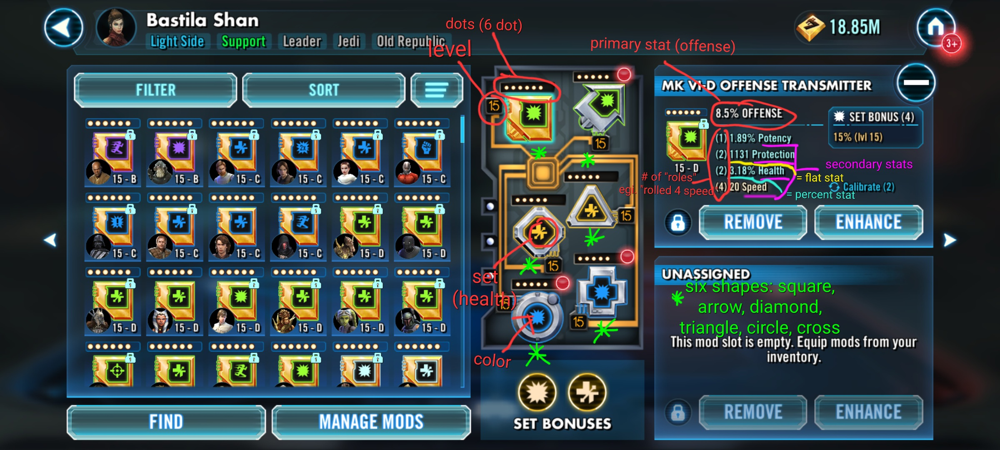
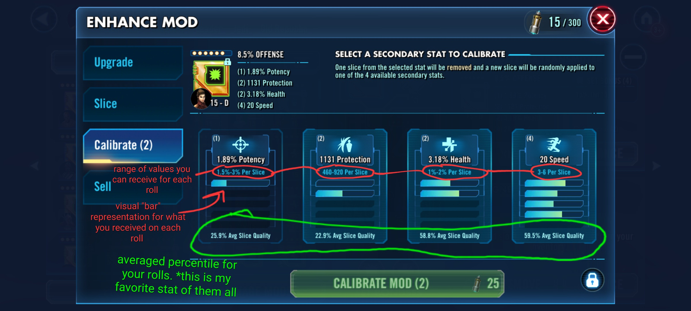
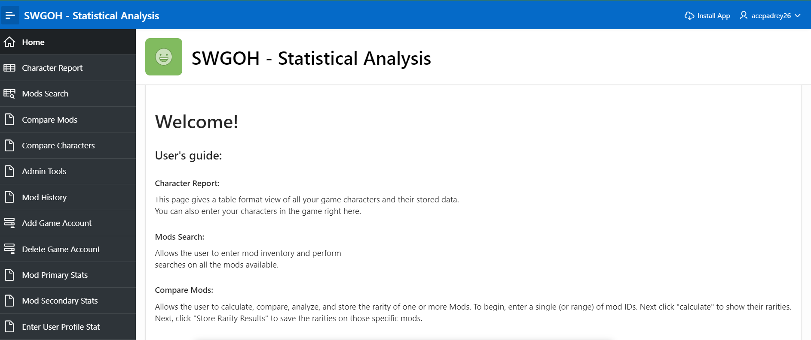
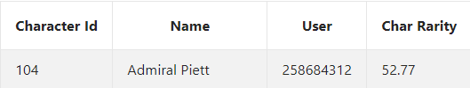
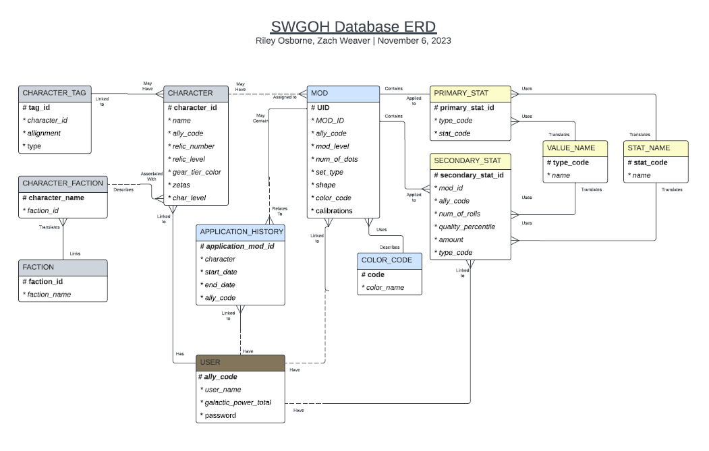
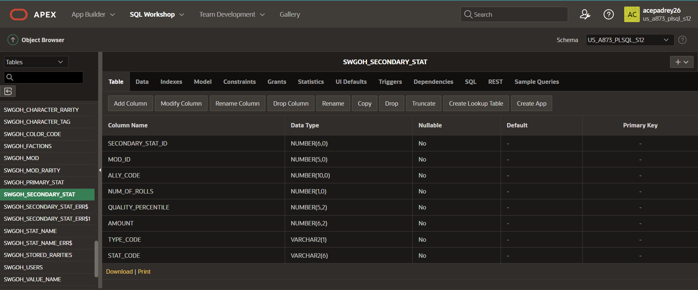

[Back to Portfolio](./)

SWGOH User Profile Database
===============

-   **Class: CSCI 419 Database Management** 
-   **Grade: ??B??** 
-   **Language(s): Oracle SQL** 
-   **Source Code Repository: This project does not have github source code as it was an oracle database application. For the link to the site login** [click here](https://iacademy2.oracle.com/ords/f?p=4550:1:573426648849:::::)  
    (Please [email me](mailto:rwosborne@csustudent.net?subject=GitHub%20Access) to request access credentials!)

## Project description

The Star Wars Galaxy of Heroes (SWGOH) User Profile Database is a database application based off the SWGOH mobile game. In the game you are given an Allycode that uniquely identifies your username and roster. In your roster you have Star Wars toons that you use in teams to defeat other Star Wars characters in numerous game modes. The most important aspect of the game in my opinion is the mods that you put on your characters. This is the only thing that can make your roster and characters 100% unique, since there are so many possible combinations of mod sets, mod colors, mod primary stats, and four mod secondary stats. In the game, there are 6 different mod shapes and each character can have up to one of each mod shape applied to them. The mods are upgradable and even if the combination of a mod's set, primary stat, and four secondary stats are completely idetical (which is highly unlikely), which secondary stat is chosen to upgrade when upgrading is random as well as how much of a stat boost you are given. Figure 1 offers a labeled, detailed overview of what mods look like in game. The game will measure how rare your secondary stats are with percentile and bar indicators (see Fig 2). The problem is that this is only available within the game. The database application was developed to manage what characters you have, your character stats, what mods you have, mathematically calculate and track how good their secondary stats are, and help you balance out your mod inventory's variety by tracking how many mods you have for each mod set type, primary set type, and shape.

  
Fig 1. Labeled mod overview from in-game 

  
Fig 2. Secondary stats overview from in-game 

## How to run the program

Click the link at the top of the page under "source code repository" to be directed to the Oracle log in screen. 
The workspace name will be "US_A873_PLSQL_S12" and please contact me for the username and password.
Once you have logged in with your credentials:
    Click the App Builder
    Click the "SWGOH - Statistical Analysis" app #12375
    Click run application
    Use the same username and password to log into the app

You are now in the app!

## UI Design

The home page (see Fig 1) gives you a guide on how to use the 11 pages listed inside the top left hamburger menu.

The stat input pages (Mod Primary Stats / Mod Secondary Stats / Enter User Profile Stat*):
These pages are used to update a user's galactic power attribute and allow you to create and associate new primary and secondary stat entities with existing mods.
*NOTE -  the password used for the "Enter User Profile Stat" page is "SWGOH".

The Admin Tools page allows you to reset the mod and character rarities that the database is calculating. 

The Compare Characters page allows you to see what the "rarity" of a character's mods is (see Fig 2). This is calculated by adding all six of the character's mod rarities together and averaging them. A character rarity of 50 is average, above 50 is above average rarity, and below 50 is below average rarity.

In the Mod History page you can view a table that lists a mod's application history, which includes when and on what character a mod has been used.

In the Compare Mods page you are able to view and compare mods individually by their rarity, shape, and set type.

  
Fig 1. The application home page welcome

  
Fig 2. Example character table entry with "rarity"

## 3. Additional Considerations

This was a two person project, Zach Weaver and myself included, which proved to be quite difficult. The course was set up around the backend of a database and the workings of OraceSQL. The course pretty much did not offer any UI supplementary material for the project. That said, the UI turned out very rough and uncoopertive. We had created a solid, complicated back end structure that worked well and set it up, but did not have the advanced skills to set up a sufficient UI front end. For your reference, a picture of the ERD is provided (see Fig 1) so you can get a vivid picture of the database's complex backend structure. Actual in game data was used for testing, and you can manually view the database's entire contents if you go to "SQL Workshop" instead of "App Builder" after logging into Oracle. From there you can go to "Object Browser" to view the structure or contents of the project tables, all of which will start with "SWGOH" (see Fig 2). Just make sure you have the non-admin schema selected from the drop down menu on the right. The other option is to select "SQL Commands" from the "SQL Workshop" menu, where you can use OracleSQL to create whatever queries you desire.

  
Fig 1. Project Entity Relationship Diagram (ERD)

  
Fig 2. SWGOH_Secondary_Stat table structure view from the Object Brower.

For more details see [GitHub Flavored Markdown](https://guides.github.com/features/mastering-markdown/).

[Back to Portfolio](./)